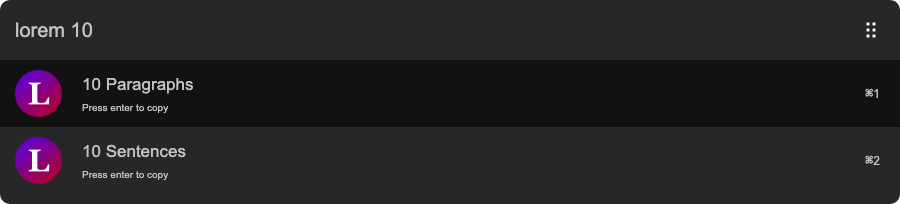

# arvis-loremipsum

> Grab placeholder text in [Arvis](https://github.com/jopemachine/arvis)

## 🔗 This workflow is converted from [alfred-workflow](https://github.com/AntonNiklasson/alfred-loremipsum).

* Note that there might be some code change or different actions from the original workflow.

* Marked original workflow's creator to author.

## Install

```
$ npm install --global arvis-loremipsum
```

*Requires [Node.js](https://nodejs.org) 4+.*


## Usage

In arvis, type `lorem`, <kbd>Enter</kbd>, and your query.

Add an optional number to grab more than one paragraph or sentence.



## License

MIT © [Anton Niklasson](http://antonniklasson.se)
